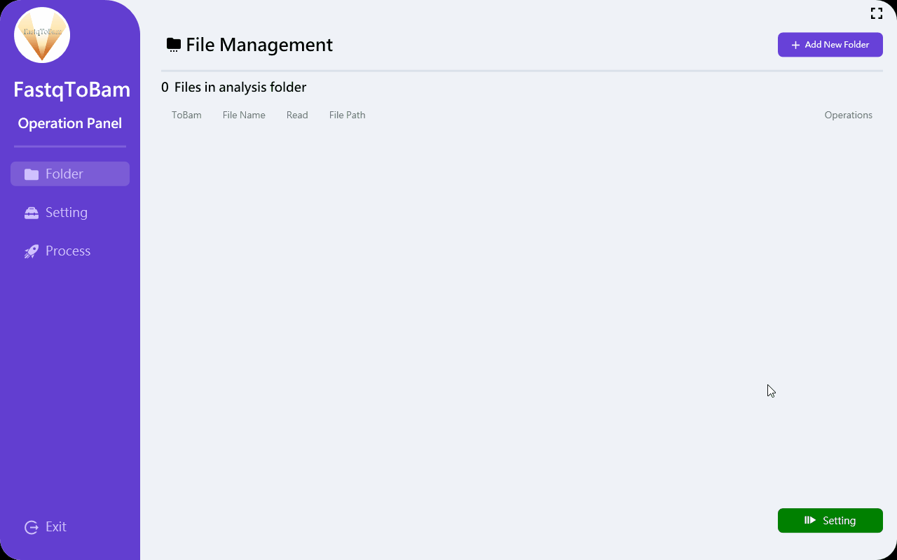
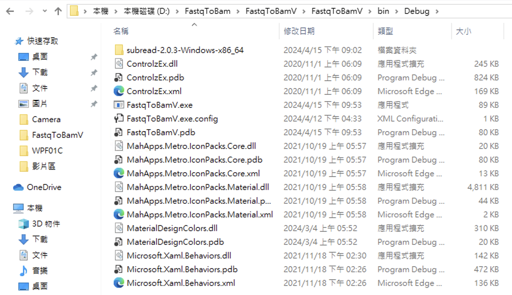
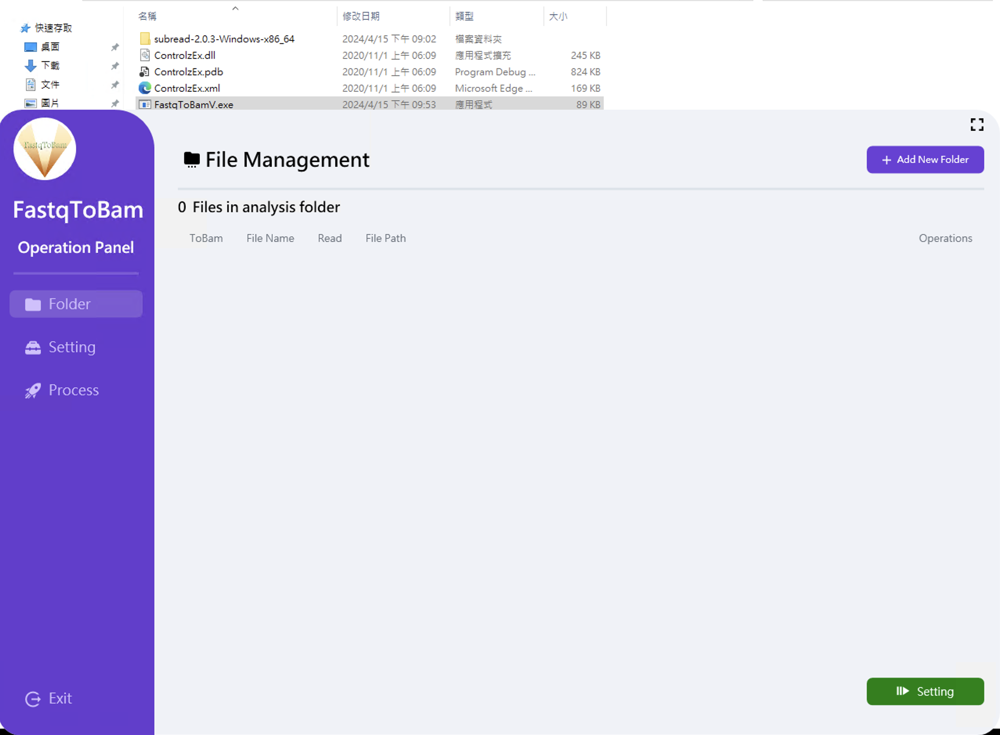

# FastqToBamV

   

An visualize analysis tool that converts FASTQ files to BAM format without entering any commands



## Introduction

The generation of Bam files is a fundamental prerequisite for subsequent operations during NGS analysis. However, individuals without coding experience may find it challenging to write suitable shell scripts to process FASTQ files into BAM format in batches. FastqToBamV addresses this issue by offering a user-friendly graphical interface. Leveraging tool like fastp, FastqToBamV efficiently produces BAM files, simplifying the process for users.

## Features

1. Supports only paired-end reads.
2. Compatible with the GRCh38 human reference genome.
3. Enables multithreading for efficient read processing within the program.
4. Allows specification of DNA-Seq or RNA-Seq for processing.
5. Provides real-time display of running results.

## Installation

- Clone the project to your device or simply download the Debug folder under FastqToBamV/bin/Debug.

  ```html
  git clone https://github.com/finalfantasyliu/FastqToBam
  ```

- Due to file size limitations on GitHub, please download the dependency file from the following link and decompress it.

  ```html
  https://drive.google.com/file/d/1k9GrfRu0FWOKg8g2IPEoO0H_TR7tYHHq/view?usp=sharing
  ```

- Please ensure that the dependency folder is properly located within FastqToBamV/bin/Debug.

  

- Click FastqToBam.exe to run program.

  
